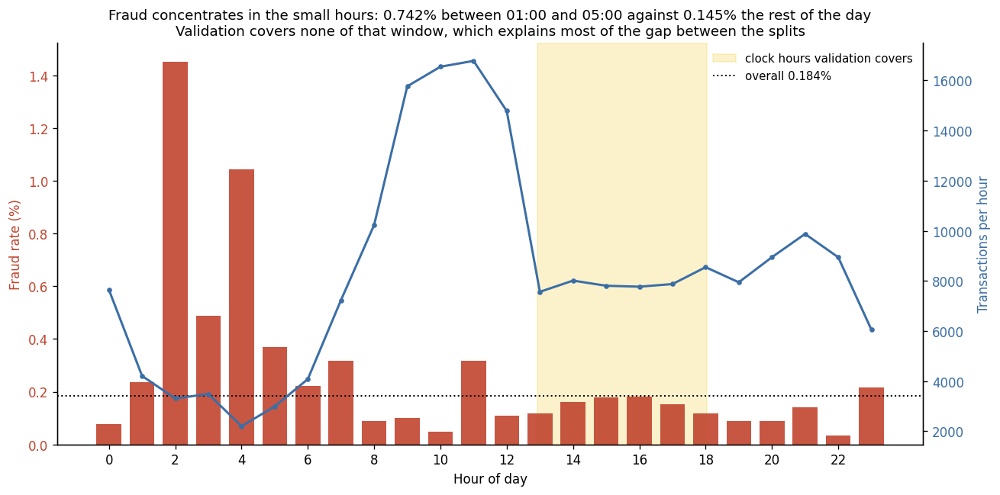
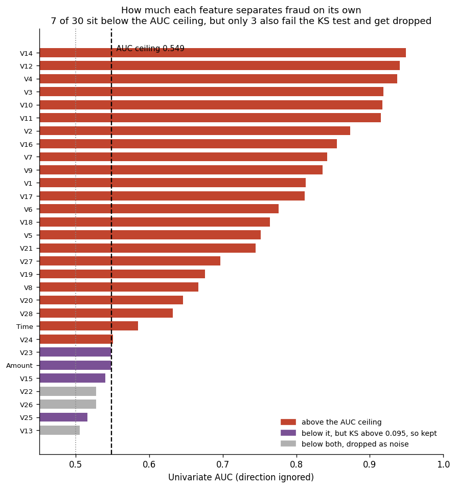
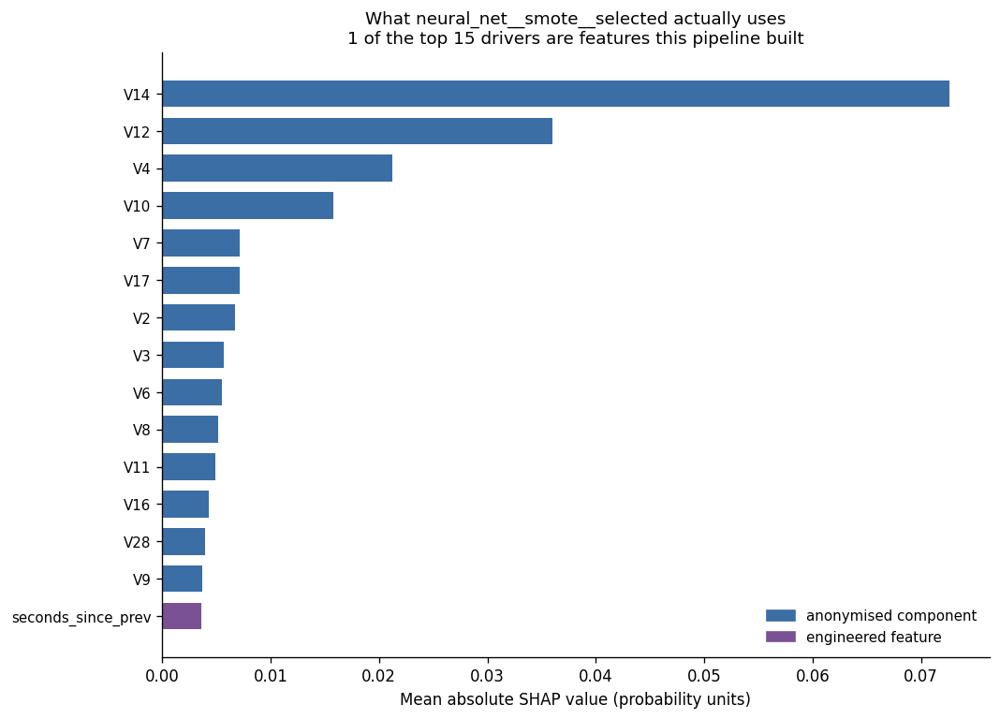

# Fraud Detection Pipeline

An end to end credit card fraud detection system. It goes from a raw transaction file to a
trained and registered model, a scoring API, and a dashboard that explains why a
transaction was flagged. Everything runs from the command line and inside Docker.

> **Status: in progress.** Stages 1 to 6 run on the real data. A champion is chosen against
> a cost model, scored once on the held out test split, explained with SHAP, and registered
> in MLflow. Serving, the dashboard and Docker remain. See the branch plan in
> [CONTRIBUTING.md](CONTRIBUTING.md).

## The problem

Banks, card networks and payment companies score every transaction in real time. Two things
make this hard:

1. **The classes are extremely imbalanced.** In the ULB dataset only 492 of 284,807
   transactions are fraud, which is 0.17 percent. A model that predicts "not fraud" every
   single time is 99.83 percent accurate and completely useless. This is why accuracy is not
   reported anywhere in this project.
2. **The two mistakes cost different amounts.** A false negative is fraud that got through.
   A false positive is a real customer whose card was blocked at the till. The model has to
   sit at a chosen point on that trade off, not at an arbitrary 0.5 threshold.

The goal is to catch as much fraud as possible while keeping false alarms low enough that
the business would actually run it.

## The data

| Dataset | Rows | Fraud rows | Fraud rate | Where |
| --- | --- | --- | --- | --- |
| Credit Card Fraud (ULB) | 284,807 | 492 | 0.172 percent | [Kaggle](https://www.kaggle.com/datasets/mlg-ulb/creditcardfraud) |
| IEEE CIS Fraud Detection | about 590,000 | about 20,600 | about 3.5 percent | [Kaggle](https://www.kaggle.com/c/ieee-fraud-detection) |

The ULB set comes first because it is small and clean, so the whole pipeline can be proven
end to end quickly. The IEEE set is added later for richer feature engineering.

The data is never committed. See [data/raw/README.md](data/raw/README.md) for how to get it.

## The pipeline

Eight stages, each one a command. The real pipeline lives in `src/`. Notebooks are for
exploring only.

| Stage | Command | What it does | Status |
| --- | --- | --- | --- |
| 1. Ingest | `make ingest` | Read the raw file, type it, write an interim table | done |
| 2. Validate | `make validate` | Quality rules and the split. Stops the run if the data is wrong | done |
| . EDA | `make eda` | Measure every feature, then select automatically from what it finds | done |
| 3. Features | `make features` | Build features, then reselect over the engineered set | done |
| 4. Train | `make train` | Sweep models, imbalance strategies and feature sets | done |
| 5. Evaluate | `make evaluate` | Tune the threshold, then open test once | done |
| 6. Register | `make register` | Promote the champion, with a margin | done |
| 7. Serve | `make serve` and `make app` | FastAPI endpoint and Streamlit dashboard | |
| 8. Package | `make docker-up` | The whole thing in containers | |

`make all` runs stages 1 to 6 in order. On Windows use `.\tasks.ps1 all` instead, since
Windows does not ship `make`.

### Data quality and the split

Stage 2 runs ten named checks before anything is trained, and writes
[reports/tables/validation_report.md](reports/tables/validation_report.md). Two of them
found something worth knowing about this dataset.

**There are 1,081 exact duplicate rows**, 19 of them fraud. With 28 continuous components
matching to full precision, these are double entries rather than coincidence. They are
dropped, which leaves 283,726 rows. They do not leak across the split, because copies share
a timestamp and land in the same block, but keeping them would let a model count the same
transaction twice.

**The split is by time, not at random.** A real system always scores transactions made
after the ones it learned from, and fraud patterns drift. A random split quietly lets the
model learn from the future and reports a score the deployed system would never reach.

| Split | Rows | Fraud rows | Fraud rate |
| --- | --- | --- | --- |
| Train | 198,608 | 366 | 0.184 percent |
| Validation | 42,558 | 55 | 0.129 percent |
| Test | 42,560 | 52 | 0.122 percent |

That fraud rate is not flat across the three parts, and the reason turned out to be more
interesting than plain drift. See the next section.

It also sets a limit on how much the results can be trusted: with 52 fraud cases in the
test set, one extra catch moves recall by about two points. The results table reports that
uncertainty rather than quoting four decimal places as if they were solid.

## What the exploration found

`make eda` measures every feature on the training split, then selects features from what it
measures. It never reads the test split, and the config refuses to let it. Full output in
[reports/tables/eda_report.md](reports/tables/eda_report.md).

### Fraud follows the clock, not just the calendar



Fraud is **5.1 times more likely between 01:00 and 05:00** (0.742 percent) than during the
rest of the day (0.145 percent), and those hours are exactly when transaction volume is at
its lowest.

This changes how the split table above should be read. Validation covers only 12:52 to
18:03 on the clock, so it contains none of the high fraud window. Restricting training to
that same clock window drops its fraud rate from 0.184 to 0.156 percent, close to
validation's 0.129. **Most of the gap between the splits is which hours they contain, not
fraud behaviour changing over the two days.**

It also means the chronological split has a real limitation on this dataset. The file is
only 48 hours long, so no single split can cover a full daily cycle, and neither validation
nor test contains the small hours. The IEEE CIS dataset spans months and will not have this
problem.

### How much signal is real



The threshold here is measured, not chosen. Shuffling the target 40 times and recording the
best AUC any of the 30 features still reached by chance gives an average of 0.535 and a peak
of 0.557. So on this dataset, with only 366 fraud rows in training, **a feature carrying no
information at all can still score about 0.55.** Anything below that is indistinguishable
from a column of random numbers.

Taking the maximum across all features on each shuffle is the point. Testing 30 features and
keeping the best is 30 chances to be fooled, and the maximum statistic accounts for that.

### No leakage, no duplicates

Nothing reaches the 0.99 AUC leakage threshold. No two features are correlated above 0.95,
and the strongest pair anywhere is V2 with Amount at 0.55.

Both are the expected answers rather than lucky ones. V1 to V28 are principal components, so
they are orthogonal to each other by construction, and no original column survives that
could encode the answer. The checks still run on every pipeline run, because the IEEE CIS
dataset has real named columns where a leak is a genuine possibility.

## Automatic feature selection

The selection system applies rules with measured thresholds and records the evidence behind
every drop. Output in
[reports/tables/feature_selection.md](reports/tables/feature_selection.md).

Rules come in two tiers, and the split between them matters.

**Tier 1 is correctness.** Leakage, duplicates, constant columns, and features whose next
period values fall outside the training range. Keeping any of these is a mistake rather than
a preference.

**Tier 2 is judgement.** Dropping features with no measurable signal. This is arguable,
because univariate screening cannot see interactions, so it is separated out and can be
switched off.

That produces three feature sets, and the pipeline can train on any of them:

| Set | Features | What it is |
| --- | --- | --- |
| `all` | 30 | no selection, the honest baseline |
| `safe` | 29 | tier 1 only |
| `selected` | 26 | tier 1 and tier 2 |

Whether selection actually helps is a question for the results table, not an assumption.

### What got dropped, and why

| Feature | Tier | Reason |
| --- | --- | --- |
| `Time` | 1 | 0.00 percent of validation values fall inside the training range |
| `V22` | 2 | AUC 0.528 and KS 0.080, both below the noise ceilings |
| `V26` | 2 | AUC 0.527 and KS 0.086, both below the noise ceilings |
| `V13` | 2 | AUC 0.505 and KS 0.083, both below the noise ceilings |

`Time` is the interesting one. It only ever increases, so every future value is larger than
anything the model trained on and the model is being asked to extrapolate past the edge of
its experience. A shifted distribution is survivable. No overlap at all is not. It stays in
the data as a pipeline input, because hour of day gets derived from it, and hour of day both
carries more signal (0.61 AUC against 0.58) and covers the range completely.

### A feature has to fail two tests, not one

Four features sit below the AUC ceiling and are still kept: `Amount`, `V23`, `V15` and
`V25`. They survive because AUC only sees whether fraud sits consistently high or low, and
they separate the classes without doing that.

`Amount` is the clearest case. It scores 0.548 AUC, below the ceiling, while its KS distance
is 0.260, nearly three times the KS ceiling. Fraudulent amounts really are distributed
differently, they are just not consistently larger or smaller. An AUC only version of this
rule dropped `Amount`, and that was wrong.

## Feature engineering

`make features` builds 15 new features from `Time` and `Amount`, carries the 28 components
and `Amount` through unchanged, and then runs the same selection rules again over the
engineered set. Full output in
[reports/tables/feature_engineering.md](reports/tables/feature_engineering.md).

The brief also asks for rolling aggregates per card and category encodings. Neither is
possible on this dataset, and it is better to say so than to skip it quietly: ULB contains
`Time`, `V1` to `V28`, `Amount` and `Class`, and nothing identifies a cardholder. The same
ideas are applied to the global transaction stream instead. Per card versions arrive with
IEEE CIS.

### Two rules that pull in opposite directions

**A feature may look backwards, never forwards.** A rolling average over the previous 50
transactions is exactly what a deployed system has at scoring time, so these are computed
across the whole ordered stream including split boundaries. Building them inside each split
separately would be worse, because validation would start from a cold baseline that
production never has.

**A fitted statistic may only come from training.** Means, standard deviations, quantiles.
These summarise the data they are fitted on, so fitting one on everything folds the future
into every row.

Only two numbers are fitted here, both used to fill the gap at the very start of the stream
where a history feature has no history yet. Everything else is pointwise or built from a
row's own past, which is why there is so little to fit.

### Which new features earned their place

10 of 15 survived selection. The pattern is consistent and makes sense.

| Kept | AUC | | Dropped | AUC |
| --- | --- | --- | --- | --- |
| `txn_rate_10` | 0.626 | | `amount_roll_mean_10` | 0.504 |
| `txn_rate_50` | 0.622 | | `amount_roll_std_10` | 0.510 |
| `hour` | 0.610 | | `amount_dev_10` | 0.508 |
| `hour_sin` | 0.593 | | `amount_roll_mean_50` | 0.533 |
| `seconds_since_prev` | 0.586 | | `amount_roll_std_50` | 0.536 |

**The raw baselines were dropped and the comparisons were kept.** `amount_roll_mean_10`
describes the recent stream, not the transaction being scored, so it carries almost nothing
on its own. `amount_ratio_10`, which compares this amount against that baseline, scores
0.554 with a KS of 0.222. The useful feature was never the baseline, it was the distance
from it.

**The time features are the strongest thing built.** `txn_rate_10` at 0.626 beats every
engineered feature and beats raw `Time` at 0.584, which is the feature it effectively
replaces. That follows directly from the EDA finding: fraud concentrates in the small hours,
and those are exactly the hours when the stream is quiet.

### A caveat on the time features

`hour` has a PSI of 8.99 and `txn_rate_10` a PSI of 1.21, the two largest in the set. That
is not drift in the usual sense, it is the 48 hour window problem again: training covers a
full daily cycle and validation covers only 12:52 to 18:03.

So the strongest new features are also the ones validation is least able to check. They stay
in, because their range coverage is complete and dropping the best signal to avoid an
awkward validation set would be the wrong trade. It does mean the validation score will
understate how much these features are worth, and it is a reason to treat the eventual
train to validation gap with some suspicion rather than as pure overfitting.

## Model results

Five models, three imbalance strategies, two feature sets. 30 fits.

**These are validation numbers. The test split has not been opened.** Once a held out set has
been used to choose between 30 candidates it is no longer held out, so stage 5 opens it once,
after the threshold is fixed. Full output in
[reports/tables/baseline_results.md](reports/tables/baseline_results.md).

The top of the table, plus the best run for each model:

| Model | Imbalance | Features | PR AUC | 95% interval | P@80% recall | Brier | Fit |
| --- | --- | --- | --- | --- | --- | --- | --- |
| Random Forest | SMOTE | 44 | 0.8725 | [0.786, 0.955] | 0.882 | 0.00073 | 118s |
| Random Forest | class weights | 36 | 0.8671 | [0.775, 0.951] | **0.957** | 0.00045 | 71s |
| **LightGBM** | SMOTE | 44 | 0.8658 | [0.775, 0.950] | 0.936 | 0.00032 | **5.6s** |
| LightGBM | class weights | 36 | 0.8636 | [0.770, 0.948] | 0.836 | 0.00031 | 4.5s |
| XGBoost | SMOTE | 44 | 0.8625 | [0.774, 0.946] | 0.936 | 0.00035 | 7.2s |
| XGBoost | none | 44 | 0.8616 | [0.771, 0.943] | 0.846 | 0.00031 | 5.9s |
| Neural Net | none | 36 | 0.8532 | [0.760, 0.934] | 0.830 | 0.00037 | 12s |
| Neural Net | SMOTE | 36 | 0.8133 | [0.707, 0.908] | **0.957** | 0.00037 | 18s |
| Logistic Regression | class weights | 44 | 0.8395 | [0.741, 0.922] | 0.638 | 0.04777 | 4.6s |
| LightGBM | none | 44 | 0.3266 | [0.192, 0.457] | 0.001 | 0.00120 | 4.4s |

### The most important number here is the interval

**All 28 healthy runs are statistically indistinguishable.** Every interval overlaps the best
run's. With 55 fraud cases in validation, this data cannot rank these models, and the spread
from 0.8725 down to 0.7535 is inside the noise.

Without the interval, that table reads as a clean ranking and every gap in it looks like a
finding. This is what the bootstrap was added for, and it is worth more than the winner's
name.

### LightGBM is the model to ship

Random forest has the highest PR AUC. LightGBM matches it within noise and costs a twentieth
as much:

| | Random Forest, SMOTE, 44 | LightGBM, SMOTE, 44 |
| --- | --- | --- |
| PR AUC | 0.8725 | 0.8658 |
| Precision at 80 percent recall | 0.882 | **0.936** |
| Brier score | 0.00073 | **0.00032** |
| Fit time | 118s | **5.6s** |

Statistically identical ranking, better at the operating point, twice as well calibrated, and
**21 times faster to fit**. For a model that will be retrained regularly, that is not a minor
convenience.

XGBoost is the most consistent of the five, scoring between 0.855 and 0.862 across all six of
its configurations, with the best calibration in the table.

### LightGBM is also the only model that needs imbalance handling

With no imbalance handling at all, LightGBM **collapses**: it scores 0.33 and emits 13
distinct scores across 42,558 rows. The trees stop splitting, because leaf wise growth with a
minimum of 20 rows per leaf cannot isolate 366 positives among 198,608.

Random forest without any imbalance handling still reaches 0.855. So "does this model need
help with the imbalance" has a different answer per model, and for LightGBM it is not
optional.

Those two runs are flagged and excluded from the comparison rather than deleted. A collapsed
model still returns valid probabilities and a plausible looking ROC AUC of 0.78, so the
pipeline now records how many distinct scores each model emits and refuses to let a collapsed
one win the sweep. Every standard metric on those runs was in range.

### Class weighting wrecks calibration, across model families

| Model | Brier, unweighted | Brier, class weights |
| --- | --- | --- |
| Logistic Regression | 0.00053 | **0.04777** |
| Neural Net | 0.00034 | **0.03873** |
| Random Forest | 0.00039 | 0.00046 |
| XGBoost | 0.00031 | 0.00033 |
| LightGBM | n/a (collapsed) | 0.00031 |

Weighting the rare class improves ranking for the two gradient based models and makes their
probabilities roughly 90 and 110 times worse calibrated. The tree ensembles are untouched.

It ranks well and the probabilities are fiction. For a system whose output is a fraud score
in a dashboard rather than a yes or no, that matters, and it is completely invisible if you
only report ranking metrics.

### What else can be said

| Model | Mean PR AUC | | Imbalance | Mean PR AUC | | Features | Mean PR AUC |
| --- | --- | --- | --- | --- | --- | --- | --- |
| XGBoost | 0.860 | | SMOTE | 0.840 | | 44 | 0.826 |
| Random Forest | 0.863 | | class weights | 0.846 | | 36 | 0.828 |
| LightGBM | 0.727 | | none | 0.727 | | | |
| Neural Net | 0.836 | | | | | | |
| Logistic Regression | 0.802 | | | | | | |

LightGBM's mean is dragged down by its two collapsed runs, which is exactly why a mean is a
poor summary and the full table is worth reading.

**Feature selection is roughly neutral.** 44 features average 0.826 and 36 average 0.828, a
gap well inside the noise. The case for selection here is inference cost, fit time and
interpretability, not accuracy, and it would be dishonest to present it as a scoring win.
That was an open question when the selection system was built, and this is the answer.

### The primary metric picks a different winner than the operating point does

Best PR AUC is random forest with SMOTE. But precision at 80 percent recall is much closer to
how the system would actually run, and two different models tie for best on it at 0.957:
random forest with class weights on 36 features, and the neural net with SMOTE on 36.

PR AUC integrates over every threshold, including ones nobody would ever operate at. This is
why stage 5 picks the champion against the cost model rather than against the headline
metric.

## Final results, on the held out test split

The test split was opened **once**, after the threshold was frozen on validation. Full output
in [reports/tables/evaluation.md](reports/tables/evaluation.md).

Champion: **Neural Net**, SMOTE, 36 features, chosen from 28 healthy runs by expected cost at
a tuned threshold rather than by the headline metric. Threshold 0.9197.

| Measure | Validation | Test |
| --- | --- | --- |
| Recall (cases) | 0.800 | **0.635** |
| Precision | 0.957 | **0.917** |
| Value recall | 0.980 | **0.515** |
| Frauds caught | 44 of 55 | 33 of 52 |
| False alarms | 2 | 3 |

### The most important number is value recall, and it is bad news

Catching 63.5 percent of fraud **cases** and 51.5 percent of fraudulent **money** are
different results, and only the second is what a fraud team is measured on.

| Split | Frauds missed | Largest missed | Mean missed | Value recall |
| --- | --- | --- | --- | --- |
| Validation | 11 | 109 | 15 | 0.980 |
| Test | 19 | **1,097** | 158 | **0.515** |

On validation the model missed only cheap frauds. On test it missed the expensive ones: the
five largest misses were worth 1097, 634, 358, 296 and 248, which is 2,633 of the 2,993 lost.

**Validation gave a badly optimistic picture of how much money this model saves.** With about
fifty fraud cases per split, whether the handful of large ones happen to be caught swings value
recall enormously, and the validation answer did not repeat. Any claim about money saved has to
carry that caveat, and this project makes it rather than quoting the 0.980.

### Why the cost model is not a detail

A missed fraud and a false alarm cost different amounts, and neither is a modelling question.
Two ways to charge a missed fraud:

- **flat**, every miss costs the same. The mean fraudulent amount is 120.29, so 120 is the
  correct flat number. It is still the wrong summary.
- **amount**, a miss costs the value of that transaction.

The amounts are severely skewed: median 12.31, mean 120.29, max 2,125.87, with a quarter of
frauds at or below 1.00 and sixteen at exactly zero. A flat charge treats the largest fraud in
the file and a 1.00 fraud as equally worth catching.

Where the two disagree, the difference is large:

| Model | Flat | Amount | Fraudulent value recovered |
| --- | --- | --- | --- |
| LightGBM, SMOTE | 47 caught, **10 false alarms** | 44 caught, **3 false alarms** | 0.9805 vs 0.9802 |
| Random Forest, SMOTE | 48 caught, **22 false alarms** | 45 caught, **6 false alarms** | 0.9808 vs 0.9805 |

The amount model gives up about three fraud cases to remove between seven and sixteen false
alarms, and recovers the same money to three decimal places. Counting frauds and recovering
money are different objectives.

They do not disagree on every model. On models whose scores are strongly bimodal, including
the champion, both land on the same threshold, and the report says so rather than implying a
difference that is not there.

### The false alarm price is a business input, not a measurement

It is the support and churn cost of wrongly blocking a customer, and no amount of transaction
data can supply it. So it is swept rather than asserted, in
[reports/tables/threshold_sensitivity.csv](reports/tables/threshold_sensitivity.csv). On this
champion the chosen threshold is stable from 1 through 50, because its scores are bimodal
enough that no price in that range moves the decision.

## What the model is actually using

`make explain` runs SHAP over the promoted champion. Full output in
[reports/tables/explanations.md](reports/tables/explanations.md).



| Feature | Share of total importance |
| --- | --- |
| V14 | 28.4 percent |
| V12 | 14.1 percent |
| V4 | 8.3 percent |
| V10 | 6.2 percent |

**This is a cross check, not just a chart.** The exploration stage found V14, V12, V4 and V10
to be the four most separable features univariately, in that order. SHAP independently ranks
them V14, V12, V4, V10, in the same order, from a completely different calculation. Two methods
agreeing is evidence the model is using real signal rather than an artifact.

If the top driver had been something that should not matter, that would be a leak or a bug
showing up as an explanation, which is the main reason to look.

The report also includes worked examples, deliberately covering a **false alarm** and a
**missed fraud** alongside a caught one. The failures are what a reviewer learns from.

The explainer is chosen by model type, because the champion is chosen by the pipeline and can
change between runs. Tree ensembles get the exact `TreeExplainer`; anything else, including the
neural net currently promoted, gets `KernelExplainer`.

## Promotion

`make register` decides whether the champion takes the title, and records why in
[reports/tables/registry.md](reports/tables/registry.md).

Two rules:

**Judged on expected cost**, the same basis stage 5 chose the champion with. Judging promotion
on a different number would let a model win the selection and lose the promotion, which is not
a difference anyone could explain to the team running it.

**On validation cost, never test.** Promoting on the test number would fold the held out
estimate back into the decision it is supposed to be independent of.

**A challenger must win by a margin.** Without one, every rerun swaps the model whenever the
number moves at all, and with 52 fraud cases it moves for no reason. A margin turns *different*
into *better*.

The registered model carries a signature (36 float inputs, 2 probability outputs), so a served
model validates its input shape at the door rather than failing somewhere inside the pipeline.

## Quick start

You need Python 3.12 and Git. Docker is optional but it is how the finished project runs.

```bash
git clone https://github.com/krishanthdev/fraud-detection-pipeline.git
cd fraud-detection-pipeline
```

On Linux or macOS:

```bash
make setup
```

On Windows:

```bash
.\tasks.ps1 setup
```

Then download the dataset into `data/raw/` as described in
[data/raw/README.md](data/raw/README.md), and run the pipeline:

```bash
make all
```

Check that the config loaded correctly at any time:

```bash
python -m fraud_pipeline show-config
```

## Configuration

Everything the pipeline does is controlled by [configs/config.yaml](configs/config.yaml).
Nothing important is hard coded. The file is validated on load, so a typo fails immediately
with a clear message.

Any value can be overridden without editing the file:

```bash
python -m fraud_pipeline --set project.seed=7 --set models.xgboost.max_depth=8 train
```

## Reproducibility

- One seed in the config drives Python, numpy, scikit learn and torch.
- Splits are done by time, so the model is never trained on transactions that happened
  after the ones it is tested on.
- Dependencies are pinned to exact versions.
- Every run is logged to MLflow with its parameters, metrics and artifacts.

## Repository layout

```
fraud-detection-pipeline/
  app/                  Streamlit dashboard
  configs/config.yaml   every setting the pipeline uses
  data/                 raw, interim, processed (never committed)
  models/               saved artifacts (never committed, tracked in MLflow)
  notebooks/            exploration only
  reports/figures/      plots used by this README
  reports/tables/       generated results tables
  scripts/              helper scripts
  src/fraud_pipeline/   the pipeline itself
  tests/                pytest suite
  .github/workflows/    lint and test on every pull request
```

## Tech stack

Python 3.12, pandas, scikit learn, XGBoost, LightGBM, PyTorch, imbalanced learn, SHAP,
MLflow, FastAPI, Streamlit, Docker, pytest, ruff, GitHub Actions.

## Licence

MIT. See [LICENSE](LICENSE).
