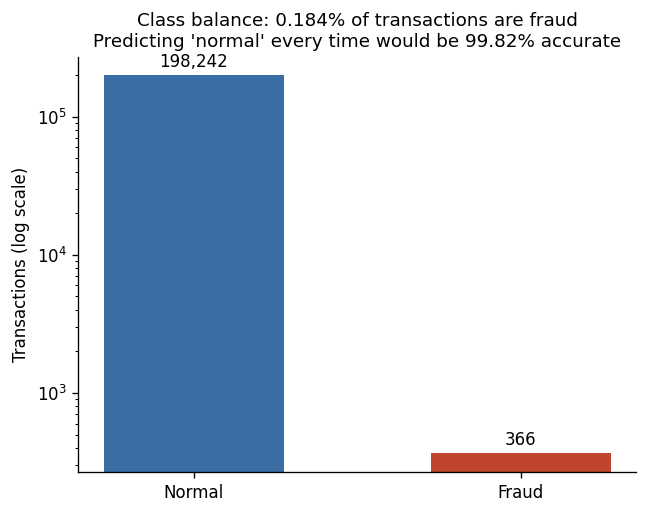
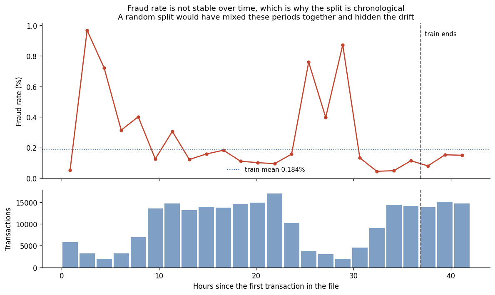
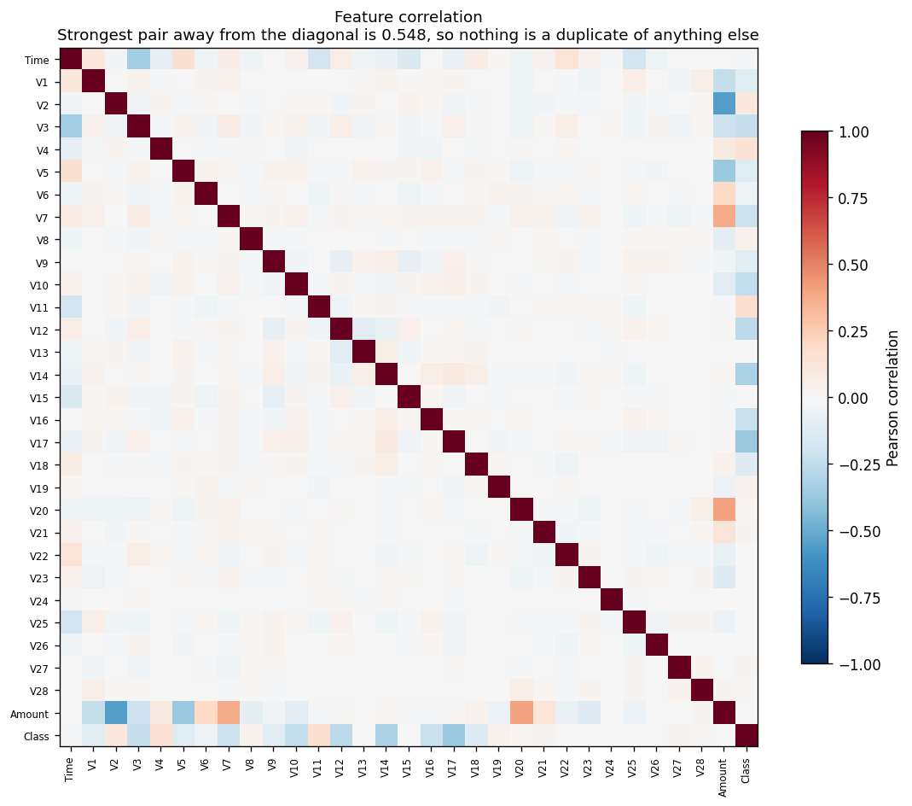
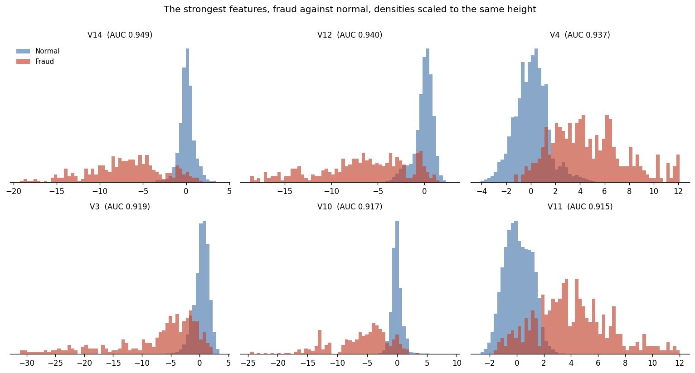
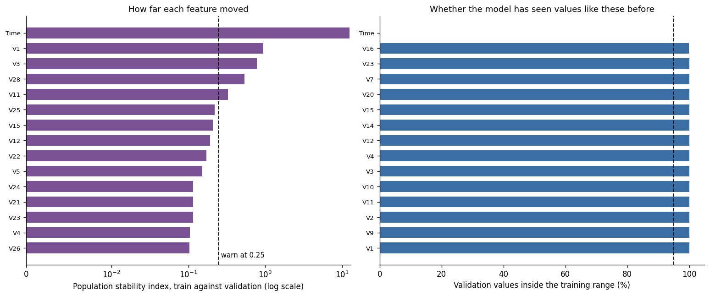

# Exploratory analysis: Credit Card Fraud Detection (ULB)

Measured on the **train** split, 198,608 rows and 366 fraud cases. Drift is measured against **validation**, 42,558 rows.

The test split was not read. Choosing features by looking at test data would make
every metric this project later reports meaningless, so the config refuses it.

## What the numbers say

- The positive class is 0.184% of transactions. Predicting normal every
  time scores 99.816% accuracy and catches no fraud at all.
- 23 of 30 features carry signal above the noise ceiling.
- The strongest single feature is **V14** at 0.9492 univariate AUC.
- Exact duplicate columns found: **0**.
- Feature pairs correlated at or above 0.95: **0**.

## Noise ceiling

with the target shuffled 40 times, the best univariate AUC any of 30 features reached by chance averaged 0.5352 and peaked at 0.5567. The 95% quantile, 0.5486, is the AUC noise ceiling. The same procedure puts the KS ceiling at 0.0952, against a chance average of 0.0781.

This is the number that turns 'weak' into something measured. With only
366 fraud rows, a feature carrying nothing at all still reaches around
0.535 AUC once you take the best of 30 tries. A
threshold picked by hand would have kept pure noise.

## Target leakage

None found. Nothing reaches the 0.99 AUC
threshold, and the strongest feature sits well below it.

That is the expected answer here rather than a lucky one. V1 to V28 are
principal components of features the publisher would not release, so there is
no original column left that could encode the answer. The check still runs on
every pipeline run, because the second dataset has real named columns where a
leak is a genuine possibility.

## Redundancy

No pair reaches the duplicate threshold. The most correlated pairs are:

| Feature A | Feature B | Absolute correlation |
| --- | --- | --- |
| V2 | Amount | 0.5478 |
| V20 | Amount | 0.4034 |
| V5 | Amount | 0.3740 |
| V7 | Amount | 0.3711 |
| Time | V3 | 0.3463 |
| V1 | Amount | 0.2350 |
| V3 | Amount | 0.2091 |
| V6 | Amount | 0.2019 |
| Time | V11 | 0.1922 |
| Time | V25 | 0.1917 |
| Time | V5 | 0.1517 |
| Time | V15 | 0.1407 |
| Time | V22 | 0.1397 |
| V21 | Amount | 0.1298 |
| V23 | Amount | 0.1267 |

The components are near orthogonal to each other, which is what PCA output
should look like. The correlations that do exist are between the components
and Amount, which was never part of that PCA.

## Stability between train and validation

| Feature | PSI | Validation values inside the training range |
| --- | --- | --- |
| Time | 12.434 | 0.00% |
| V1 | 0.938 | 100.00% |
| V3 | 0.777 | 100.00% |
| V28 | 0.534 | 100.00% |
| V11 | 0.327 | 100.00% |
| V25 | 0.220 | 100.00% |
| V15 | 0.207 | 100.00% |
| V12 | 0.191 | 100.00% |
| V22 | 0.171 | 100.00% |
| V5 | 0.151 | 100.00% |
| V24 | 0.116 | 100.00% |
| V21 | 0.116 | 100.00% |
| V23 | 0.115 | 100.00% |
| V4 | 0.105 | 100.00% |
| V26 | 0.103 | 100.00% |

## Every feature

| Feature | AUC | KS | Absolute correlation | Mutual info | PSI | Range coverage |
| --- | --- | --- | --- | --- | --- | --- |
| V14 | 0.9492 | 0.8423 | 0.3146 | 0.0297 | 0.064 | 1.0000 |
| V12 | 0.9405 | 0.7830 | 0.2655 | 0.0274 | 0.191 | 1.0000 |
| V4 | 0.9373 | 0.7596 | 0.1418 | 0.0201 | 0.105 | 1.0000 |
| V3 | 0.9188 | 0.7052 | 0.2301 | 0.0189 | 0.777 | 1.0000 |
| V10 | 0.9172 | 0.8159 | 0.2435 | 0.0279 | 0.036 | 1.0000 |
| V11 | 0.9152 | 0.7666 | 0.1637 | 0.0253 | 0.327 | 1.0000 |
| V2 | 0.8735 | 0.6539 | 0.1053 | 0.0141 | 0.021 | 1.0000 |
| V16 | 0.8556 | 0.7156 | 0.2222 | 0.0235 | 0.004 | 0.9999 |
| V7 | 0.8422 | 0.6947 | 0.2186 | 0.0175 | 0.078 | 1.0000 |
| V9 | 0.8360 | 0.5668 | 0.1027 | 0.0157 | 0.049 | 1.0000 |
| V1 | 0.8128 | 0.5173 | 0.1209 | 0.0093 | 0.938 | 1.0000 |
| V17 | 0.8112 | 0.7549 | 0.3685 | 0.0302 | 0.032 | 1.0000 |
| V6 | 0.7760 | 0.4913 | 0.0491 | 0.0091 | 0.055 | 1.0000 |
| V18 | 0.7639 | 0.5357 | 0.1326 | 0.0170 | 0.025 | 1.0000 |
| V5 | 0.7519 | 0.5055 | 0.1194 | 0.0113 | 0.151 | 1.0000 |
| V21 | 0.7443 | 0.5377 | 0.0290 | 0.0107 | 0.116 | 1.0000 |
| V27 | 0.6965 | 0.4774 | 0.0257 | 0.0098 | 0.045 | 1.0000 |
| V19 | 0.6756 | 0.3566 | 0.0410 | 0.0053 | 0.018 | 1.0000 |
| V8 | 0.6669 | 0.3839 | 0.0423 | 0.0078 | 0.059 | 1.0000 |
| V20 | 0.6455 | 0.3637 | 0.0233 | 0.0043 | 0.057 | 1.0000 |
| V28 | 0.6322 | 0.3806 | 0.0079 | 0.0074 | 0.534 | 1.0000 |
| Time | 0.5843 | 0.1636 | 0.0131 | 0.0064 | 12.434 | 0.0000 |
| V24 | 0.5503 | 0.1068 | 0.0053 | 0.0015 | 0.116 | 1.0000 |
| V23 | 0.5481 | 0.2121 | 0.0077 | 0.0029 | 0.115 | 1.0000 |
| Amount | 0.5479 | 0.2604 | 0.0052 | 0.0069 | 0.003 | 1.0000 |
| V15 | 0.5401 | 0.1024 | 0.0071 | 0.0003 | 0.207 | 1.0000 |
| V22 | 0.5278 | 0.0800 | 0.0072 | 0.0009 | 0.171 | 1.0000 |
| V26 | 0.5274 | 0.0861 | 0.0026 | 0.0006 | 0.103 | 1.0000 |
| V25 | 0.5155 | 0.1045 | 0.0010 | 0.0013 | 0.220 | 1.0000 |
| V13 | 0.5050 | 0.0826 | 0.0020 | 0.0000 | 0.048 | 1.0000 |

## Figures

